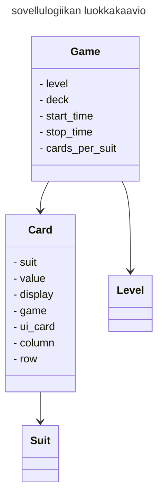
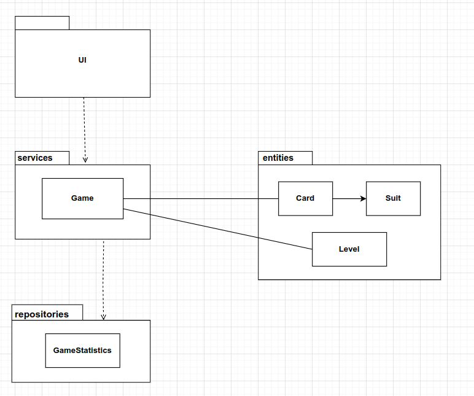
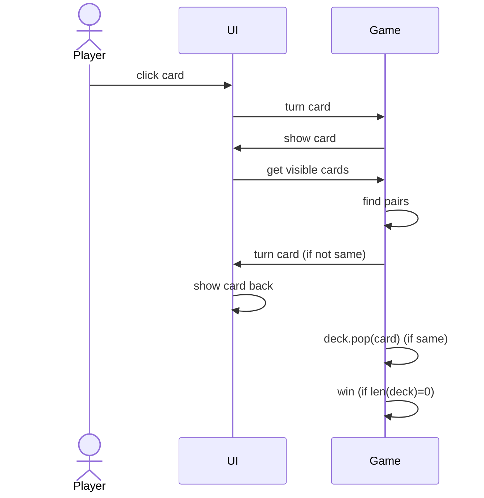
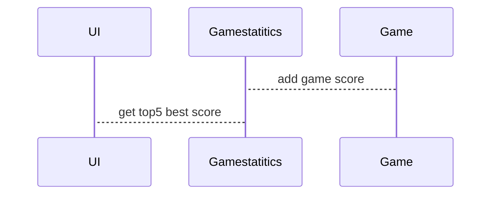

# Arkkitehtuurikuvaus

## Käyttöliittymä

Pelissä on tällä hetkellä kolme näkymää, jotka ovat:
- etusivu
- pelinohjeet
- peli

Kaikki ovat omina luokkina, nimeltä [Welcome_view](../ui/welcome_view.py), [Game_view](../ui/game_view.py) ja [Guide_view](../ui/how_to_play_guide.py). Main kutsuu luokka [UI](../ui/ui.py), joka näyttää nämä näkymät tai poistaa näkymiä.

Game_view luo kortin kuvan. Käyttöliittymässä on vielä luokka [UiCard](../ui/ui_card.py), joka laittaa kortit näkyville Game_view:hin pelajalle. Se kutsuu luokka Game, jotta pystyy kääntämään kortin. 

Game_view:ssa on myös metodeja, jotka vastaavat pelin suoritusajan näyttämisestä ja kertoo, että onko peli voitettu. 

## Sovelluslogiikka

Luokkassa [Game](../services/game.py) luodaan peli eli siinä tarvitaan luokan [Card](../entities/card.py) tiedot ja kortti tarvitsee luokan [Suit](../entities/card_suit.py) tiedot. Luokka Game tarvitsee myös luokan [Level](../entities/game_level.py) tiedot.

Luokassa Game on metodeja, jotka vastaa pelin toiminnalisuudesta.
Näitä ovat esimerkiksi:
- create_game (luo pelin)
- place_cards (kertoo kortille, missä sen paikka on)
- find_pairs (tarkistaa, että onko valitut kortit pari)
- get_visible_cards (laittaa listaan oikeinpäin käänetyt kortit)
- handle_cardback (mitä kortille tehdään, kun pelaajaa valitsee kortin)
- win (tarkistaa pelin voiton)

Pakkauskaaviossa näkyy, miten UI luokka, Game luokka ja [GameStatistics](../repositories/game_statitics_repository.py) repositorio  on keskenään linkitettyjä. Pelissä UI:n [Game_view](../ui/game_view.py)  luokka tallentaa pelin päädettyä suorituksen ajan repositorioon.

## Päätoiminnallisuudet

Pelaaja valitsee kortin ja painaa sitä; sekvenssikaaviona.

Kun pelaaja on voittanut pelin.

## Pelin suoritusajan tallentaminen

Kun peli alkaa, niin se tekee samalla tietokanna initialisointi ja ottaa yhteyden Gamestatitics repositoriin.
Gamestatistics luokka tallentaa pelin suoritusajan SQLite-tietokantaan. Gamestatistics luokassa on metodi get_best_score, joka kerää 5 parasta suoritusaikaa ja laittaa sen näkyville etusivulle. 

