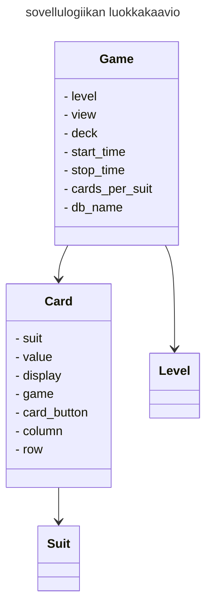
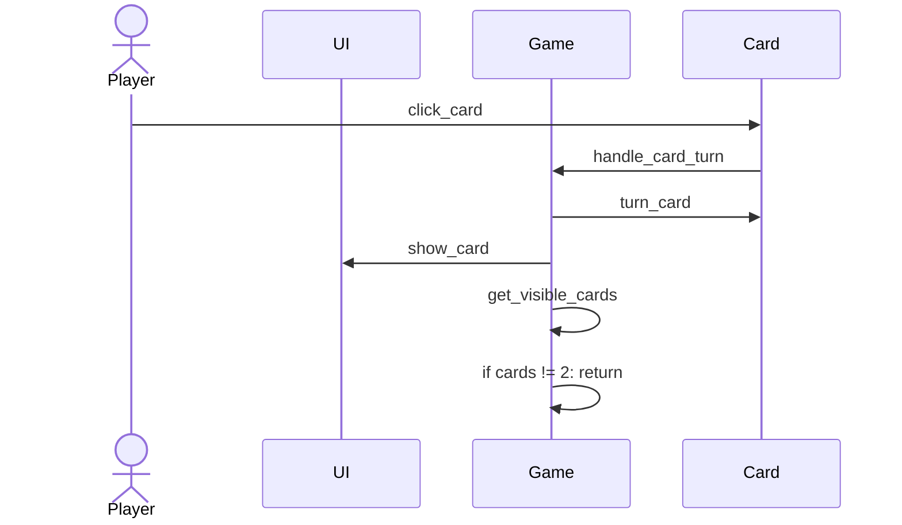
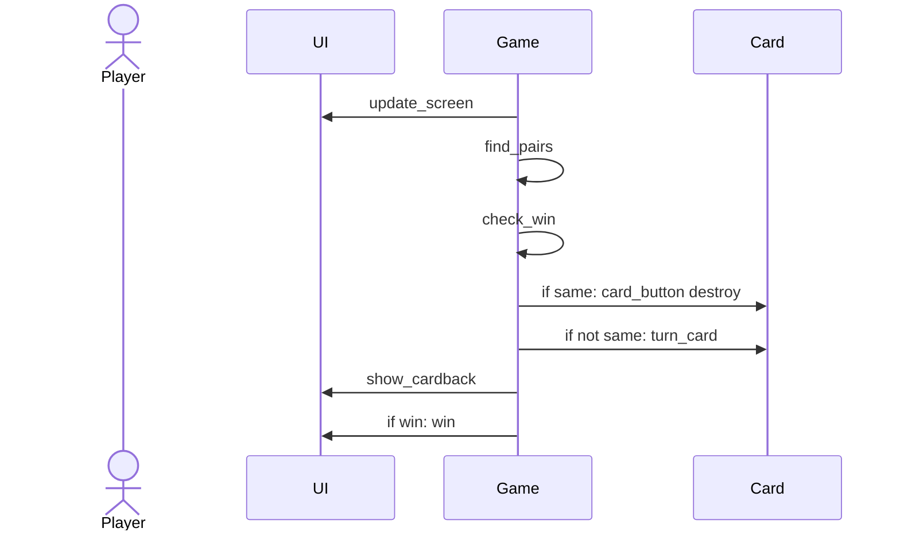
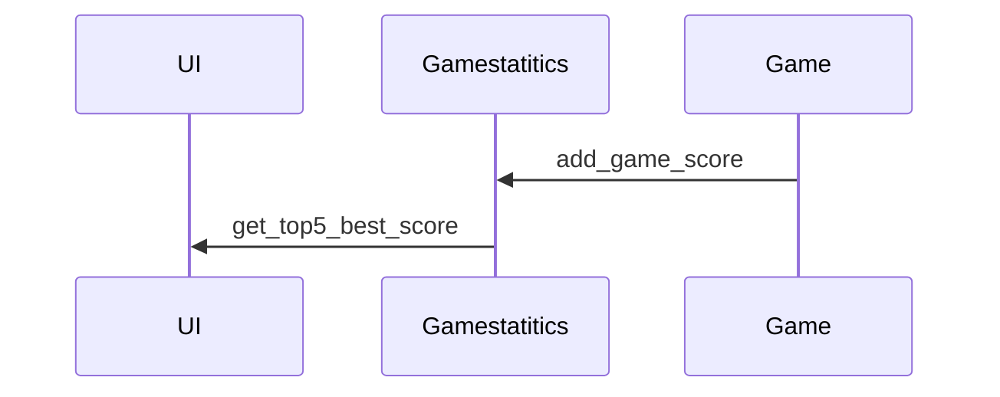

# Arkkitehtuurikuvaus

## Käyttöliittymä

Pelissä on tällä hetkellä kolme näkymää, jotka ovat:
- etusivu
- peli
- pelinohjeet

Kaikki ovat omina luokkina, nimeltä [Welcome_view](../src/ui/welcome_view.py), [Game_view](../src/ui/game_view.py) ja [Guide_view](../src/ui/how_to_play_guide.py). Main kutsuu luokka [UI](../src/ui/ui.py), joka näyttää nämä näkymät tai poistaa näkymiä.

Game_view luo kortille nappulan, kuvan ja laittaa kortit näkyville oikeille paikoille pelajalle. 

Game_view:ssa on myös metodeja, jotka vastaavat pelin suoritusajan näyttämisestä, ajastimen renderöimisestä ja näyttää onnittelu tekstin, kun peli on voitettu. 

## Sovelluslogiikka

Luokkassa [Game](../src/services/game.py) luodaan peli eli siinä tarvitaan luokan [Card](../src/entities/card.py) tiedot ja kortti tarvitsee luokan [Suit](../src/entities/card_suit.py) tiedot. Luokka Game tarvitsee myös luokan [Level](../src/entities/game_level.py) tiedot.

Luokassa Game on metodeja, jotka vastaa pelin toiminnalisuudesta.
Näitä ovat esimerkiksi:
- create_game (luo pelin)
- place_cards (kertoo kortille, missä sen paikka on)
- find_pairs (tarkistaa, että onko valitut kortit pari)
- get_visible_cards (laittaa listaan oikeinpäin käänetyt kortit)
- handle_card_turn (mitä kortille tehdään, kun pelaajaa valitsee kortin)
- check_win (tarkistaa pelin voiton)

Pakkauskaaviossa näkyy, miten UI luokka, Game luokka ja [GameStatistics](../src/repositories/game_statitics_repository.py) repositorio  on keskenään linkitettyjä. Pelissä Game luokka lisää suoritusajan pelin päädettyä repositorioon.

## Päätoiminnallisuudet

Pelaaja valitsee kortin ja painaa sitä; sekvenssikaaviona. 

Jos pelaaja on vain valinnut yhden kortin, niin alkaa alusta ja pelaaja valitsee toisen kortin. Sen jälkeen tarkistetaan, onko valitut kortin arvot samoja. (Tämä esimerkki on Easy taso!)

Kun pelaaja on voittanut pelin. Etusivulla näkyy pelin top5 parasta suoritusaikaa.

## Pelin suoritusajan tallentaminen

Kun peli alkaa, niin se tekee samalla tietokanna initialisointi ja ottaa yhteyden Gamestatitics repositoriin.
Gamestatistics luokka tallentaa pelin suoritusajan SQLite-tietokantaan. Gamestatistics luokassa on metodi get_best_score, joka kerää 5 parasta suoritusaikaa ja laittaa sen näkyville etusivulle. 

