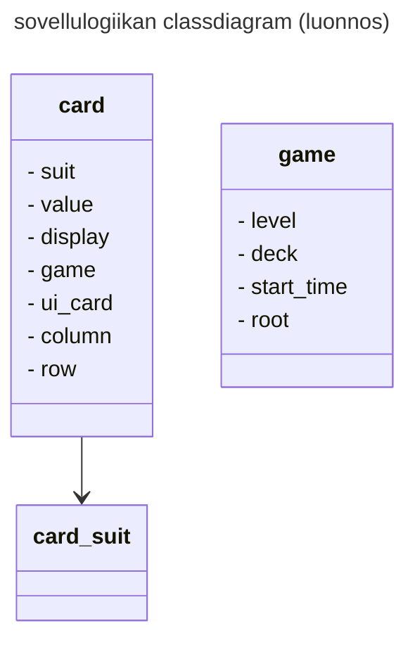
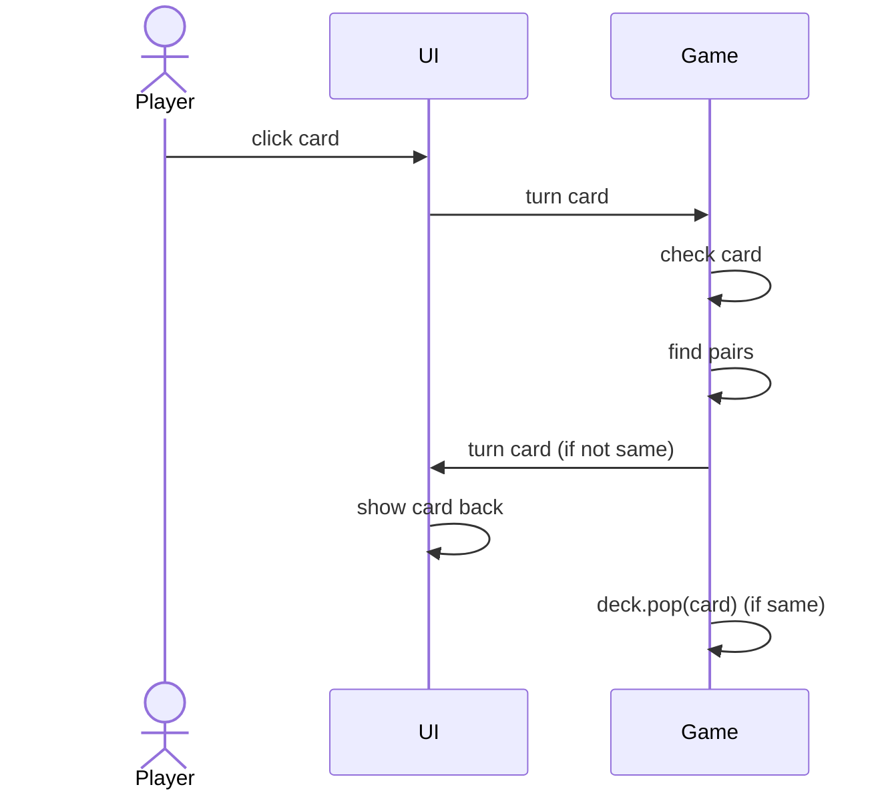

# Arkkitehtuurikuvaus

## Sovelluslogiikka

```mermaid
---
title: sovellulogiikan classdiagram (luonnos)
---
classDiagram
class card{
    - suit
    - value
    - display
    - game
    - ui_card
    - column
    - row
}
class card_suit
class game{
    - level
    - deck
    - start_time
    - root
}
card --> card_suit
```

## Päätoiminnallisuudet

Pelaaja valitsee kortin ja painaa sitä sekvenssikaaviona.

```mermaid
sequenceDiagram
    actor Player 
    participant UI
    participant Game
    Player ->> UI: click card
    UI ->> Game: turn card
    Game ->> Game: check card
    Game ->> Game: find pairs
    Game ->> UI: turn card (if not same)
    UI ->> UI: show card back
    Game ->> Game: deck.pop(card) (if same)
```