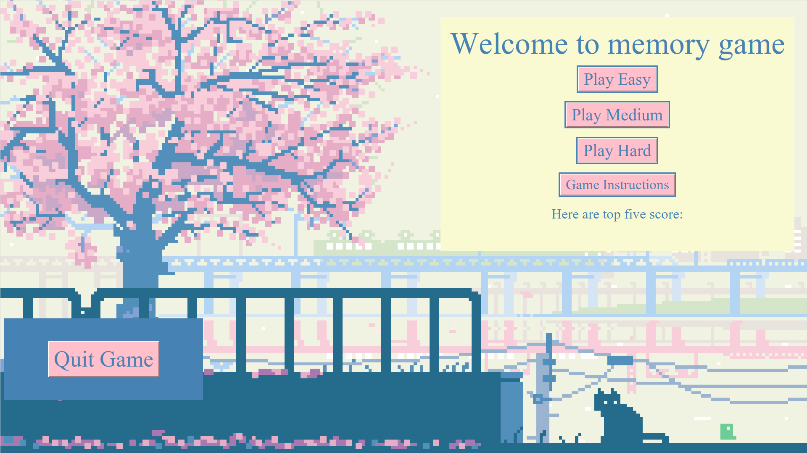
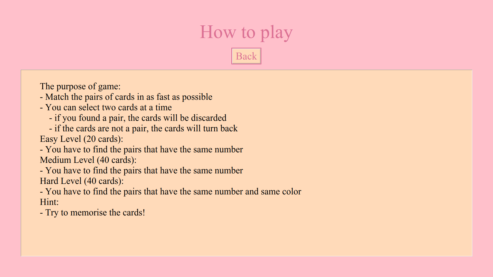

# Käyttöohje
Lataa peli viimeisin [release] lähdekoodi ja unzip source code. 

## Pelin käynnistäminen
Lataa Poetry:
```
poetry install
``` 
Pelin käynnistys komennolla:
```
poetry run invoke start
```

## Pelin etusivu
Kun peli käynnistetään, näkyy etusivu:


Paina o nappulasta, jotta peli on koko ruudun tilassa.

Painamalla game instructions voi nähdä ohjeen, miten peliä pelataan.


Jos haluaa poistua pelistä, niin voi painaa x nappulaa yläkulmasta.

## Peli näkymä
Painamalla Play Easy avaa peli näkymän easy tasolle.

Painamalla Play Medium avaa peli näkymän medium tasolle.

Painamalla Play Hard avaa peli näkymän hard tasolle.


Painamalla quit game voi palata pelin etusivulle. Peli ei tallennu, joten peli alkaa alusta sen jälkeen. Kun kaikki parit on löydetty, sivulla näkyy CONGRATULATIONS<3 eli olet voittanut pelin ja siinä näkyy myös suoritusaika.


