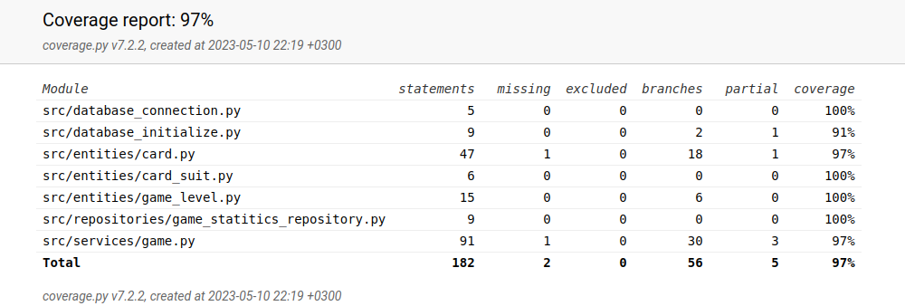

# Testausdokumentti
Peli on testattu automatisoidulla unitesteillä.

## Testit
Testit ovat jaettu kolmeen osaan:
- [korttien testit](../tests/card_test.py)
- [korttipakan testit](../tests/card_deck_test.py)
- [repositorion testit](../tests/repository_test.py)

Kortti testiin on tehty ui testi luokka, joka imitoi oikeaa ui luokkaa, jotta luokan Game:in handle_card_turn:iä voisi testata.
Testissa on käytössä testirepositorio, jotta pelin gamestatiticsrepositorio pysyy koskemattomana.

### Testikattavuus
Testikattavuus on 97%, kun testien ulkopuolelle on jätetty käyttöliittymä, testit itse.

Testit testaavat suurin osaksi tarpeellisia toimintoja. Testikattavuus voisi olla 100%, mutta sitten tulisi turhia testejä.
Peliä on myös testattu manuaalisesti ui:n avulla, kun peliä on tehty. Peli on testattu toisella linux koneella käyttöohjeen mukaisesti. 

### Peli jäännet laatuongelmat
Peliin ei ole tehty virheilmoituksia, koska peliin on suuniteltu yksinkertainen käyttöliittymä ja pelissä on vain yksinkertaisia nappuloita. Peli on testattu, ettei se kaadu virheisiin. 

Peliä on suunniteltu ja testattu yhdellä(1920x1080) näyttöresoluutiolla, joten pelin full-screen toiminto saattaa näyttää eri tavalla muilla näytöllä. Pelin taustakuva on tehty siten, että muttuu näyttöresoluution mukaan, mutta muut teksit ja napppulat ei muutu. Tämä harjoitustyön tarkoitus ei ollut tämä, joten se on jätetty tälläiseksi.

