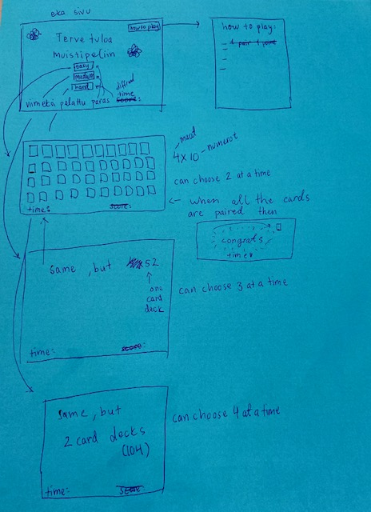

# Vaatimusmäärittely

## Pelin tarkoitus
Pelissä on eri tasoja, jotka ovat easy, medium ja hard. Niissä korttimäärä vaihtelee. Pelaaja voi valita minkä vaikeustason hän haluaa pelata. Pelissä on tarkoitus valita kaksi korttia, jotka ovat molemmat samaa numeroa. Kortit ovat aluksi väärinpäin ja kortteja saa kääntää 2 kerralla. Sitten kun kaikki parit on löydetty, niin pelin voittaa. 

## Käyttöliittymäluonnos

## Perusversion tarjoama toiminnallisuus
- On tervetuloa sivu, missä on how to play-ohje **tehty**
- aluksi pelissä on vain easy mode **tehty**
- siinä on 40 korttia **tehty**
- pitää valita 2 korttia samalla vuorolla ja yrittää saada parin **tehty**
- siinä on ajastin, joka laskee pelin suoritusajan **tehty**

## Jatkokehitysideoita
Näitä muutoksia tehdään, siiten kun perusversio on tehty ja on aikaa kehitellä lisää:
- lisätään peliin medium ja hard versio **tehty**
- lisätään etusivuun top 5 parasta aikaa eli mitkä ovat lyhyimmät pelin suoritusajat **tehty**
- lisätään congrats teksti voittaessaan pelin **tehty**
- on kirjautumissivu
- pelaaja voi valita eri teeman korteille
- pelaaja voi valita yleisesti teeman pelinäkymälle
- miten kortit poistuu näytöstä (eri animaatioita)
- väärän kortin valitseminen johtaa yhteen vähennettyyn pisteeseen
- vinkki nappula
- korttien paikka muuttuu extra hard versiossa
