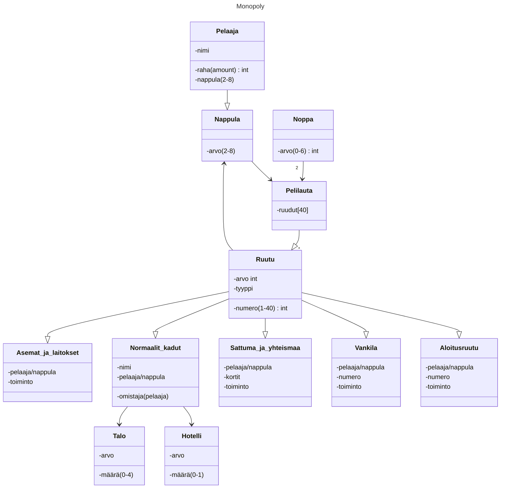

```mermaid
---
title: Monopoly
---
classDiagram
    class Pelaaja{
    -nimi
    -raha (amount) int
    -nappula (2-8)
    }
    class Nappula{
    -arvo (2-8)
    }
    class Noppa{
    -arvo (0-6) int
    }
    class Pelilauta{
    -ruudut[40]
    }
    class Ruutu{
    -numero (1-40) int
    -arvo int
    -tyyppi
    } 
    class Aloitusruutu{
    -pelaaja/nappula
    -numero
    -toiminto
    }
    class Vankila{
    -pelaaja/nappula
    -numero
    -toiminto
    }
    class Sattuma_ja_yhteismaa{
    -pelaaja/nappula
    -kortit
    -toiminto
    }
    class Asemat_ja_laitokset{
    -pelaaja/nappula
    -toiminto
    }
    class Normaalit_kadut{
    -nimi
    -omistaja (pelaaja)
    -pelaaja/nappula
    }
    class Hotelli{
    -arvo
    -määrä(0-1)
    }
    class Talo{
    -arvo
    -määrä(0-4)
    }
Pelaaja --|> Nappula 
Nappula --> Pelilauta
Pelilauta --|> "*" Ruutu
Ruutu --> Nappula
Noppa "2" --> Pelilauta
Ruutu --|> Aloitusruutu
Ruutu --|> Vankila
Ruutu --|> Sattuma_ja_yhteismaa
Ruutu --|> Normaalit_kadut
Ruutu --|> Asemat_ja_laitokset
Normaalit_kadut --> Hotelli
Normaalit_kadut --> Talo
```
