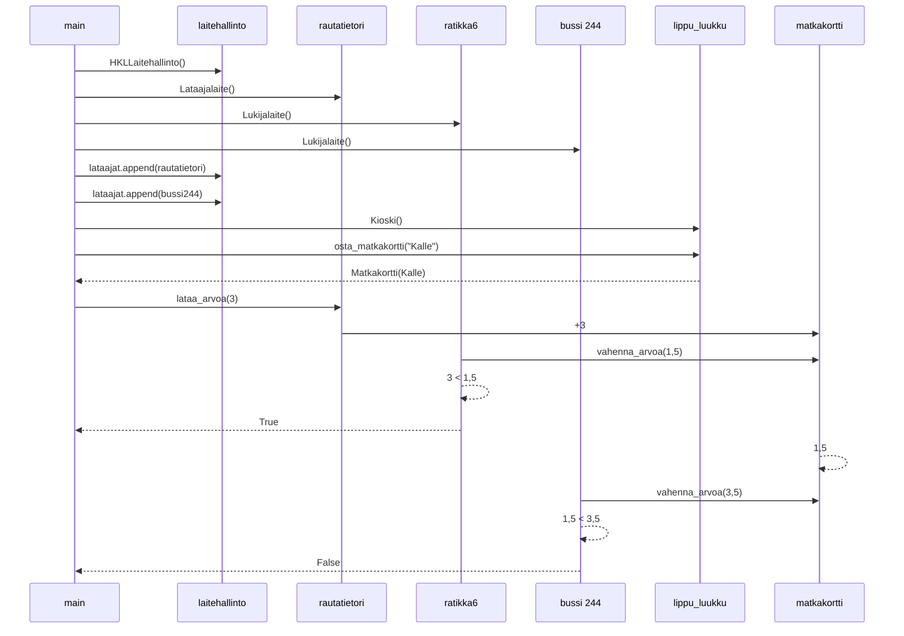

```mermaid
sequenceDiagram
    participant m as main 
    participant l as laitehallinto
    participant r as rautatietori
    participant ra as ratikka6
    participant b as bussi 244
    participant li as lippu_luukku
    participant ma as matkakortti
    m->>l: HKLLaitehallinto()
    m->>r: Lataajalaite()
    m->>ra: Lukijalaite()
    m->>b: Lukijalaite()
    m->>l: lataajat.append(rautatietori)
    m->>l: lataajat.append(bussi244)
    m->>li: Kioski()
    m->>li: osta_matkakortti("Kalle")
    li-->>m: Matkakortti(Kalle)
    m->>r: lataa_arvoa(3)
    r->>ma: +3
    ra->>ma: vahenna_arvoa(1,5)
    ra-->>ra: 3 < 1,5
    ra-->>m: True
    ma-->>ma: 1,5
    b->>ma: vahenna_arvoa(3,5)
    b-->>b: 1,5 < 3,5
    b-->>m: False
```
