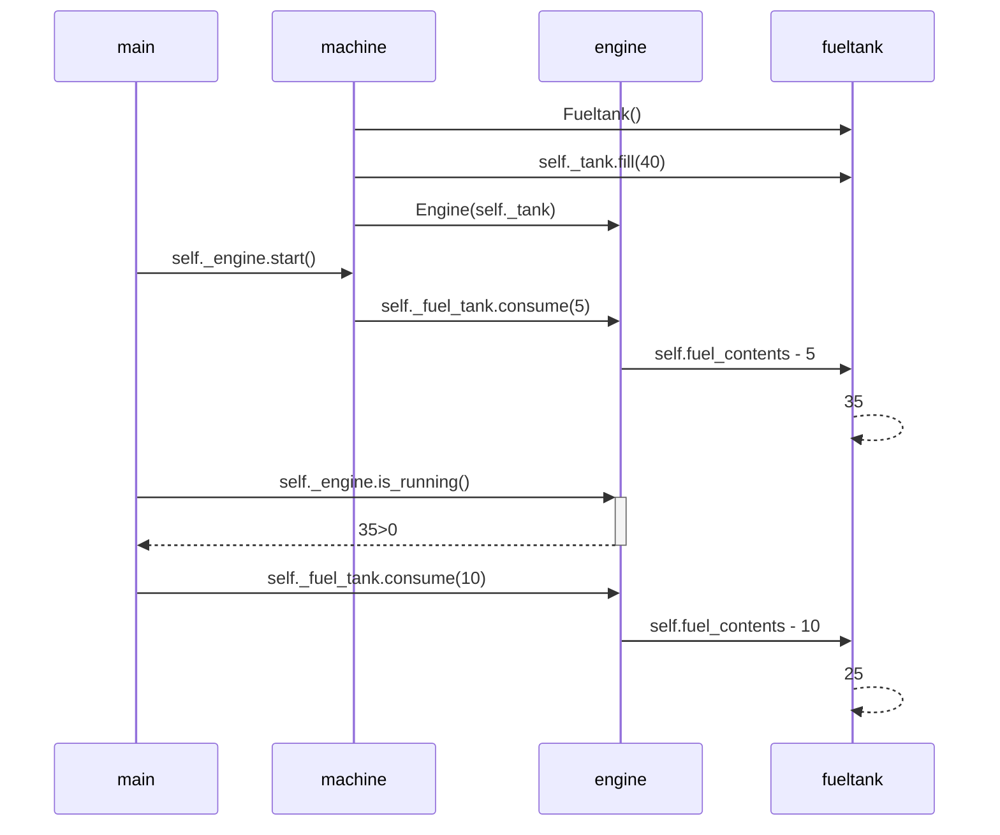

```mermaid
sequenceDiagram
    participant m as main 
    participant ma as machine
    participant e as engine
    participant f as fueltank
    ma->>f: Fueltank()
    ma->>f: self._tank.fill(40)
    ma->>e: Engine(self._tank)
    m->>ma: self._engine.start()
    ma->>e: self._fuel_tank.consume(5)
    e->>f: self.fuel_contents - 5
    f-->>f: 35
    m->>+e: self._engine.is_running()
    e-->>-m: 35>0
    m->>e: self._fuel_tank.consume(10)
    e->>f: self.fuel_contents - 10
    f-->>f: 25
```

